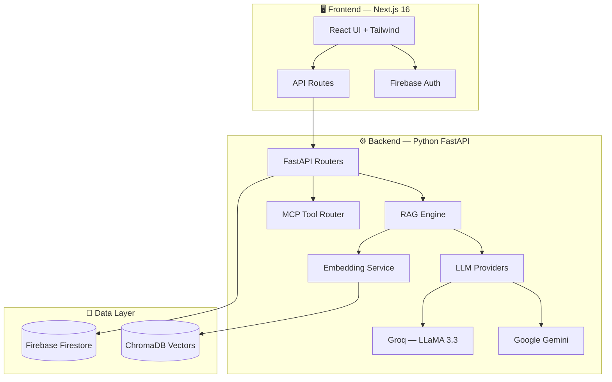

<div align="center">

# ⬡ Axon

**Your AI-Powered Second Brain**

*Capture, organize, and recall your knowledge with AI — ask questions, get answers sourced from your own notes.*


</div>

---

## ✨ Features

| Feature | Description |
|---------|-------------|
| 📝 **Smart Capture** | Save notes, links, and insights with AI-powered auto-tagging |
| 🤖 **AI-Powered Recall** | Ask questions and get answers sourced from your own notes |
| ✨ **Auto-Summarize** | AI generates summaries so you can scan your knowledge fast |
| 🔍 **Semantic Search** | Find knowledge using meaning, not just keywords (RAG + vector search) |
| ⚡ **Command Palette** | Keyboard-first — press `Ctrl+K` to navigate anything |
| 🌐 **Public API** | Rate-limited REST API for external integrations |
| 🔐 **Firebase Auth** | Email/password, Google Sign-in, and passwordless magic links |
| 📧 **Welcome Email** | Automated onboarding email for new users |

---

## 🏗 Architecture



---

## 📁 Project Structure

This is a **monorepo** — frontend and backend live together.

```
second-brain/
│
├── app/                       # Next.js pages & API routes
│   ├── dashboard/             # Dashboard (knowledge CRUD, search, chat)
│   ├── login/                 # Auth (email, Google, magic link)
│   ├── api/                   # API routes (proxies to backend)
│   └── docs/                  # Documentation page
│
├── components/                # React components
│   ├── dashboard/             # Dashboard-specific components
│   ├── landing/               # Landing page sections
│   └── ui/                    # Reusable UI (shadcn + custom)
│
├── lib/                       # Shared utilities
│   ├── ai/                    # AI providers, RAG, context engine
│   ├── firebase/              # Firebase config, auth, Firestore
│   └── email/                 # Nodemailer welcome email
│
├── backend/                   # 🐍 Python FastAPI backend
│   ├── app/
│   │   ├── main.py            # FastAPI entry point
│   │   ├── config.py          # Pydantic Settings
│   │   ├── models/            # Request/Response schemas
│   │   ├── routers/           # API endpoints
│   │   ├── services/          # LLM, RAG, Embeddings, MCP
│   │   ├── db/                # Firebase + ChromaDB
│   │   └── middleware/        # Auth + Rate limiting
│   ├── requirements.txt
│   ├── Dockerfile
│   └── README.md              # Backend-specific docs
│
├── package.json               # Frontend dependencies
├── .env.example               # Environment template
└── README.md                  # ← You are here
```

---

## 🚀 Quick Start

### Prerequisites

- **Node.js** 18+ and **npm**
- **Python** 3.10+ (for backend)
- **Firebase** project ([create one](https://console.firebase.google.com))
- **Groq** API key ([get one](https://console.groq.com))
- **Google AI** API key ([get one](https://aistudio.google.com/apikey))

### Frontend Setup

```bash
# Clone the repo
git clone https://github.com/saividithvjdq/second-brain.git
cd second-brain

# Install dependencies
npm install

# Configure environment
cp .env.example .env
# Edit .env with your Firebase + AI keys

# Start development server
npm run dev
```

Open **[http://localhost:3000](http://localhost:3000)**

### Backend Setup

```bash
# Navigate to backend
cd backend

# Create virtual environment
python -m venv venv
venv\Scripts\activate          # Windows
# source venv/bin/activate     # Mac/Linux

# Install dependencies
pip install -r requirements.txt

# Configure environment
# Edit backend/.env with your API keys

# Start server
uvicorn app.main:app --reload --port 8000
```

API docs at **[http://localhost:8000/docs](http://localhost:8000/docs)**

---

## 🔌 API Reference

### Public API (no auth)

```http
GET /public/brain/query?q=your+question+here
```

### Authenticated Endpoints

| Method | Endpoint | Description |
|--------|----------|-------------|
| `POST` | `/ai/summarize` | AI-powered summarization |
| `POST` | `/ai/auto-tag` | Generate tags for content |
| `POST` | `/ai/query` | RAG query your knowledge base |
| `GET` | `/knowledge/` | List knowledge items |
| `POST` | `/knowledge/` | Create knowledge item |
| `DELETE` | `/knowledge/{id}` | Delete knowledge item |

---

## 🛠 Tech Stack

| Layer | Technology |
|-------|------------|
| **Frontend** | Next.js 16, React 19, TypeScript, Tailwind CSS 4 |
| **UI** | shadcn/ui, Framer Motion, GSAP |
| **Backend** | Python, FastAPI, Pydantic |
| **AI** | Groq (LLaMA 3.3 70B), Google Gemini 1.5 Flash |
| **RAG** | ChromaDB (vectors), all-MiniLM-L6-v2 (local embeddings) |
| **User Context** | Personalized AI via user profiles stored in Firestore |
| **Database** | Firebase Firestore |
| **Auth** | Firebase Auth (Email, Google, Magic Link) |
| **Email** | Nodemailer (Gmail SMTP) |
| **Deploy** | Vercel (frontend) + Render (backend) |

---

## 🚀 Deployment

### Frontend → Vercel
Vercel auto-detects the Next.js config. Set environment variables in Dashboard.

### Backend → Render
Set **Root Directory** to `backend` in Render settings, or use the `render.yaml` blueprint.

| Render Setting | Value |
|---------------|-------|
| Root Directory | `backend` |
| Build Command | `pip install -r requirements.txt` |
| Start Command | `uvicorn app.main:app --host 0.0.0.0 --port $PORT` |
| Health Check | `/health` |
